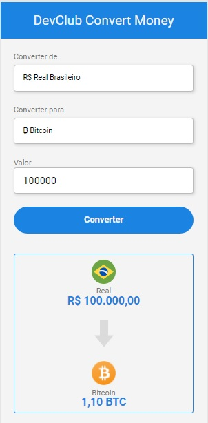

# :moneybag: Conversor de moeda :moneybag:

Projeto desenvolvido dentro do módulo de JavaScript Web, do Curso DevClub com Rodolfo Mori, curso de FullStack.
Módulo com o objetivo de juntar em um único projeto o uso de HTML, CSS e JavaScript, aplicando os conhecimentos adquiridos nos módulos anteriores.

Principal desafio foi adicionar a conversão de Real para Bitcoins, onde tive que relizar sozinha, porém, consegui aplicar corretamente, sem maiores dificuldades.

O conceito do desafio foi fixar os conhecimentos adquiridos, sendo uma grande satisfação finalizá-lo.

**Próximo passo:** será adicionar a funcionalidade de realizar a conversão do Real para as moedas (Dólar, Euro e Bitcoin) com cotação atual, quando chegar no módulo de Node.

## 🚀 Começando

Para ter acesso ao conversor de moeda, abra o index.html no seu VScode e visualize com Live Server

O código da aplicação está disponível para consulta!

### 📋 Pré-requisitos

Necessário ter o VS Code instalado no computador e ter a expansão do Live Server instalado no VS Code.

## 🛠️ Construído com

Ferramentas utilizadas para construção do conversor de moedas foram:

## 🖇️ Colaboradores

<table>
  <tr>
    <td align="right">
      <a href="https://github.com/rodolfomori" target="blank">
         
        
          <b>Rodolfo Mori</b>
        
      </a>
    </td>

  <tr>
    <td align="center">
      <a href="https://github.com/Cibell" target="blank">
         
        
          <b>Cibele (Cibell)</b>
        
      </a>
    </td>
    </table>

## ✒️ Autores

- **Autor do projeto Rodolfo Mori** - [Fundador do DevClub](https://github.com/rodolfomori)

  

## 📄 Licença

Este projeto está sob a licença DevClub
